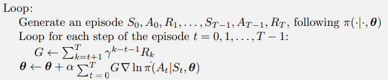

# REINFORCE for OpenAI's CartPole-v0 (PyTorch)

## Result

The environment was solved in **450 episodes**.

## REINFORCE: Pseudocode

Above is a modified version of the pseudocode from Barto & Sutton's [RL textbook](https://www.andrew.cmu.edu/course/10-703/textbook/BartoSutton.pdf) p.328.

It was modified to ***update weights EACH EPISODE***, instead of each timestep of the episode (as in the textbook).

## Cart Pole v0 Environment ([source](https://github.com/openai/gym/wiki/CartPole-v0)) ##

**STATE:**

    [Cart Position,	Cart Velocity, Pole Angle, Pole Velocity @ Tip] 
    
**ACTION:**

    0	Push cart to the left
    1	Push cart to the right
    
**REWARD:**
    
    +1 for every step taken, including the termination step
    
**Episode Termination:**

    - Pole Angle > ±12°
    - Cart Position > ±2.4 (center of the cart reaches the edge of the display)
    - Episode length > 200 steps (500 for v1)
    
**Solved Requirements:**
        
     Considered solved when: (Average Return >= 195.0) for >100 consecutive trials

## Sources
* [Barto & Sutton's RL textbook](https://www.andrew.cmu.edu/course/10-703/textbook/BartoSutton.pdf)
* [Chris Yoon's MEDIUM post](https://medium.com/@thechrisyoon/deriving-policy-gradients-and-implementing-reinforce-f887949bd63)
* [Udacity's Deep Reinforcement Learning Nanodegree](https://classroom.udacity.com/nanodegrees/nd893/dashboard/overview)
